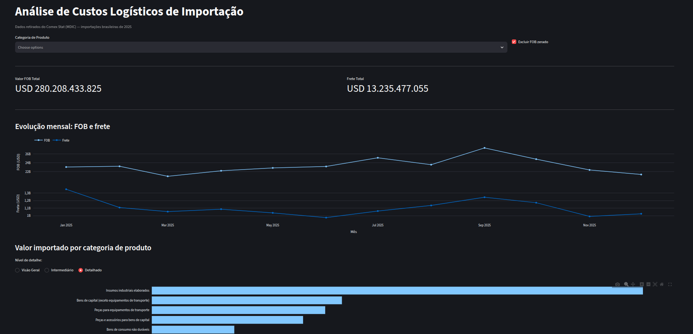

# Análise de Custos Logísticos de Importação — Comex Stat 2025

Dashboard sobre o custo logístico das importações brasileiras de 2025, construído com os dados abertos do Comex Stat (MDIC). A base cobre janeiro a dezembro de 2025, com 2.396.286 registros.

Cada registro do Comex Stat não é uma declaração de importação: é o total de todas as operações de um mesmo mês, produto, país de origem, estado, modal de transporte e local de entrada.



---

## Como cada análise foi feita

### Filtros do topo

- **Categoria de Produto:** restringe todo o dashboard a uma ou mais categorias econômicas. Sem seleção, mostra todas.
- **Excluir FOB zerado:** retira 3.039 registros sem valor comercial declarado (amostras, doações, devoluções), que têm valor de mercadoria zero mas frete pago. Vem marcado por padrão.

### Valor FOB Total

Soma do valor das mercadorias importadas, em dólares, sem frete e sem seguro.

### Frete Total

Soma do valor de frete declarado nas importações, em dólares.

### Evolução mensal: FOB e frete

Soma do valor FOB e do frete de cada mês. Os dois aparecem em painéis separados porque estão em escalas muito diferentes.

### Valor importado por categoria de produto

Soma do valor FOB por categoria econômica do produto, nas 10 maiores. O seletor muda o nível de detalhe: visão geral (5 categorias), intermediário ou detalhado.

### Custo de frete/kg por país

Frete total dividido pelo peso total importado de cada país, mostrando os 10 mais caros.

- **Filtro de modal:** separa o cálculo entre "Sem modal aéreo" e "Somente modal aéreo". O frete aéreo por quilo é mais de cem vezes mais caro que o marítimo, então misturar os dois faria o custo de um país subir só porque ele manda mais carga de avião.
- Registros sem peso informado ficam de fora, porque o frete deles entraria na conta sem peso para dividir e inflaria o resultado.
- Só entram os 30 países de maior valor importado, para que um país com poucas remessas não lidere o ranking.

### Ranking por país (Top 10)

Os 10 principais países de origem, pela métrica escolhida: valor FOB, frete total ou número de registros.

### Modal de transporte (valor FOB)

Participação de cada modal no valor FOB importado. O seletor permite ver a divisão de um país específico.

### Valor importado por bloco econômico

Soma do valor FOB por bloco econômico, nos 10 maiores. Um país que pertence a dois blocos (a Alemanha está em Europa e em União Europeia) é contado nos dois, então a soma dos blocos passa do total geral.

### Registros por estado / local de entrada

Contagem de registros por estado de destino ou por local de entrada no Brasil (porto, aeroporto ou posto de fronteira onde a carga foi desembaraçada), nos 10 maiores.

---

## Como rodar

### 1. Instalar

É preciso ter o [Conda](https://docs.conda.io/) instalado. Depois, na raiz do projeto:

```bash
conda create -n comex python=3.14
conda activate comex
pip install pandas sqlalchemy streamlit plotly
```

### 2. Baixar os dados

Os dados não estão no repositório, porque os arquivos passam do limite de tamanho do GitHub. Crie a pasta `data/` na raiz do projeto:

```bash
mkdir -p data
```

Baixe os dez arquivos da base de dados bruta do Comex Stat, na página de estatísticas de comércio exterior do MDIC, e salve dentro de `data/` com os nomes abaixo:

| Nome original | Nome no projeto |
|---|---|
| `IMP_2025.csv` | `imp_2025.csv` |
| `NCM.csv` | `ncm.csv` |
| `NCM_CGCE.csv` | `ncm_cgce.csv` |
| `NCM_UNIDADE.csv` | `ncm_unidades.csv` |
| `PAIS.csv` | `pais.csv` |
| `PAIS_BLOCO.csv` | `pais_bloco.csv` |
| `URF.csv` | `urf.csv` |
| `VIA.csv` | `via.csv` |
| `UF.csv` | `uf.csv` |
| `UF_MUN.csv` | `uf_mun.csv` |

### 3. Carregar os dados no banco

Execute de dentro da pasta `src`:

```bash
cd src
python leitura_db.py
cd ..
```

### 4. Criar a tabela tratada

Na raiz do projeto:

```bash
sqlite3 data/database.db < src/query.sql
```

Se o dashboard estiver aberto, feche-o antes de rodar este passo.

### 5. Abrir o dashboard

Na raiz do projeto:

```bash
streamlit run src/dashboard/app.py
```
